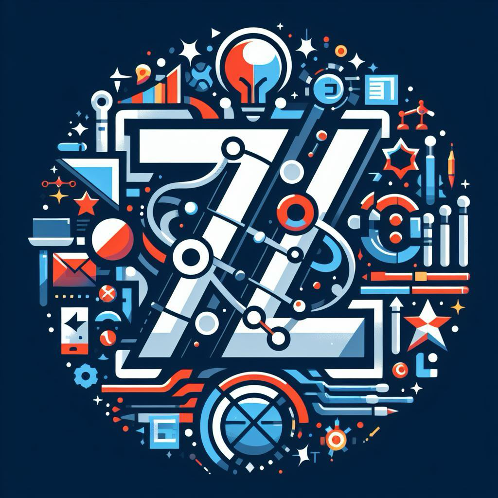

<h1 align="center">Gruppo 7Last</h1>

Progetto del corso  <em>Ingegneria del Software - 2023/2024</em>

<h2 align="center">Componenti del gruppo:</h2>

|Membro|Matricola|
|---|---|
Antonio Benetazzo | 2034528
Davide Malgarise | 2009994
Elena Ferro | 2042328
Leonardo Baldo | 2042372
Matteo Tiozzo | 2042882
Raul Seganfreddo | 1226293
Valerio Occhinegro | 2011069

<h2 align="center">Contatti:</h2>

Email: <a href="mailto:7last.swe@gmail.com"><em>7last.swe@gmail.com</em></a>

Per maggiori informazioni su come avviare il progetto o altro guarda la <a target="_blank" href="https://github.com/abenetazzo/SyncCity/blob/main/RUNNING.md">guida all'avvio</a>.

